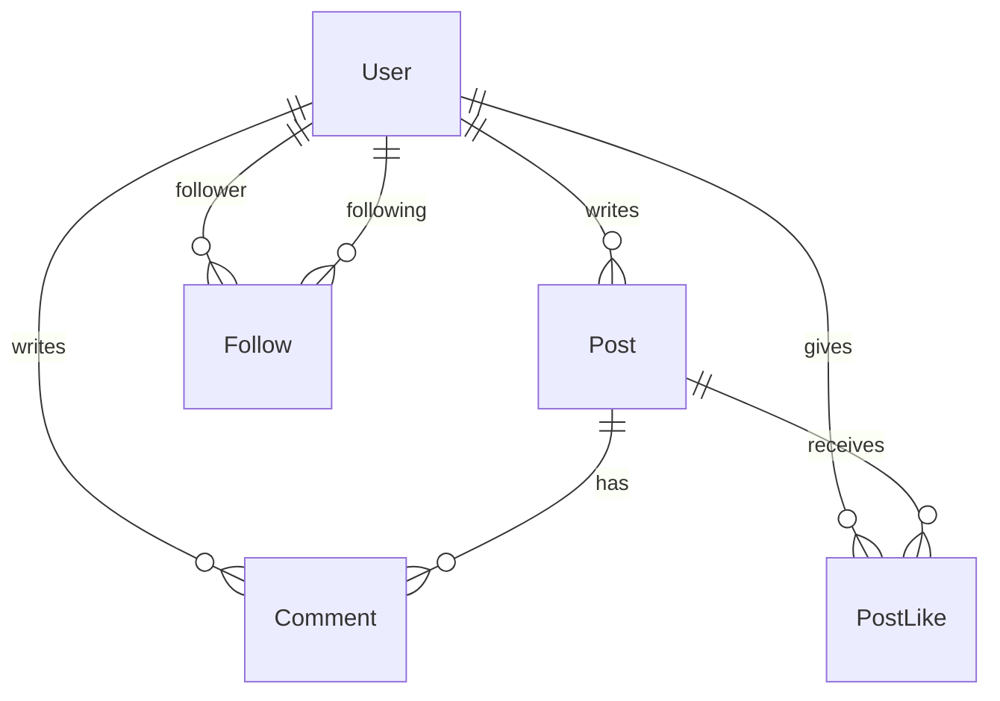

# Twizzle Phase 2 Report Draft

This draft is structured around the Phase 2 PDF requirements and can be copied into Word for the final submission.

## 1. Project Overview

Twizzle is a social media platform that started as a pure front-end Phase 1 application using HTML, CSS, vanilla JavaScript, and `localStorage`. In Phase 2, the application was upgraded to use a real relational database with Prisma, Next.js API routes, and a new analytics page built with Next.js and React.

## 2. Tech Stack

- Frontend app: HTML, CSS, Vanilla JavaScript
- Backend/API layer: Next.js App Router
- ORM: Prisma Client
- Database: SQLite
- Statistics page: Next.js + React

## 3. Data Model

The application data was normalized into five relational entities:

- `User`
- `Post`
- `Comment`
- `PostLike`
- `Follow`

### ER Diagram

### Entity Summary

- `User`: stores account information, bio, avatar URL, and join date.
- `Post`: stores message content and the author who created it.
- `Comment`: stores replies attached to a post and the user who wrote each reply.
- `PostLike`: stores many-to-many post likes between users and posts.
- `Follow`: stores many-to-many follow relationships between users.

## 4. Prisma Schema

The Prisma schema is defined in [prisma/schema.prisma](/C:/Users/Q/Documents/Codex/2026-04-27-files-mentioned-by-the-user-cmps/CMPS350project/prisma/schema.prisma:1).

Important design decisions:

- Follow relationships are stored in a dedicated join table instead of arrays.
- Post likes are stored in a dedicated join table to support counting and filtering in database queries.
- Comments belong to both a post and an author.
- All delete operations cascade so dependent rows are cleaned automatically.

## 5. Database Initialization and Seed Data

The original Phase 1 seed content was extracted into JSON files:

- [data/users.json](/C:/Users/Q/Documents/Codex/2026-04-27-files-mentioned-by-the-user-cmps/CMPS350project/data/users.json:1)
- [data/posts.json](/C:/Users/Q/Documents/Codex/2026-04-27-files-mentioned-by-the-user-cmps/CMPS350project/data/posts.json:1)

The seed implementation is in [prisma/seed.cjs](/C:/Users/Q/Documents/Codex/2026-04-27-files-mentioned-by-the-user-cmps/CMPS350project/prisma/seed.cjs:1).

It performs these steps:

1. Clears old rows in dependency-safe order.
2. Inserts users.
3. Inserts follow relationships.
4. Inserts posts.
5. Inserts comments.
6. Inserts likes.

## 6. Repository Layer

The application now uses repository modules instead of browser `localStorage`:

- [lib/repositories/user-repository.js](/C:/Users/Q/Documents/Codex/2026-04-27-files-mentioned-by-the-user-cmps/CMPS350project/lib/repositories/user-repository.js:1)
- [lib/repositories/post-repository.js](/C:/Users/Q/Documents/Codex/2026-04-27-files-mentioned-by-the-user-cmps/CMPS350project/lib/repositories/post-repository.js:1)
- [lib/repositories/stats-repository.js](/C:/Users/Q/Documents/Codex/2026-04-27-files-mentioned-by-the-user-cmps/CMPS350project/lib/repositories/stats-repository.js:1)

These repository functions handle:

- login and registration
- loading the signed-in user
- feed loading
- explore search
- profile loading
- follow/unfollow
- post creation and deletion
- likes and comments
- statistics queries

All filtering, sorting, and aggregation are pushed into Prisma queries so the database performs the work instead of the browser.

## 7. Next.js API Routes

The Phase 1 UI now calls database-backed Next.js APIs:

- `POST /api/auth/login`
- `POST /api/auth/register`
- `GET /api/users/me`
- `GET /api/users/explore`
- `GET /api/users/suggestions`
- `GET /api/users/[userId]`
- `PATCH /api/users/[userId]`
- `POST /api/users/[userId]/follow`
- `GET /api/posts/feed`
- `POST /api/posts`
- `GET /api/posts/[postId]`
- `DELETE /api/posts/[postId]`
- `POST /api/posts/[postId]/like`
- `POST /api/posts/[postId]/comments`

The route handlers are located under [app/api](/C:/Users/Q/Documents/Codex/2026-04-27-files-mentioned-by-the-user-cmps/CMPS350project/app/api:1).

## 8. Statistics Use Case

The analytics page is implemented at:

- [app/stats/page.js](/C:/Users/Q/Documents/Codex/2026-04-27-files-mentioned-by-the-user-cmps/CMPS350project/app/stats/page.js:1)

This page is built with Next.js and React and reads statistics through Prisma queries from:

- [lib/repositories/stats-repository.js](/C:/Users/Q/Documents/Codex/2026-04-27-files-mentioned-by-the-user-cmps/CMPS350project/lib/repositories/stats-repository.js:1)

### Statistics Implemented

At least six statistics were required. This implementation includes:

1. Total registered users
2. Total published posts
3. Average followers per user
4. Average posts per user
5. Average comments per post
6. Average likes per post
7. Most followed user
8. Most active user in the last 90 days
9. Most liked post
10. Most discussed post

### Example Query Types Used

- `count()` for totals such as users, posts, comments, likes, and follows
- `findFirst({ orderBy: { relation: { _count: 'desc' } } })` for top user/post lookups
- `groupBy()` for identifying the most active authors
- relation filters such as `some`, `none`, and nested `where` conditions

## 9. User Interface Changes

Phase 1 UI was preserved and moved to a Next-served static route:

- [public/twizzle/index.html](/C:/Users/Q/Documents/Codex/2026-04-27-files-mentioned-by-the-user-cmps/CMPS350project/public/twizzle/index.html:1)
- [public/twizzle/style.css](/C:/Users/Q/Documents/Codex/2026-04-27-files-mentioned-by-the-user-cmps/CMPS350project/public/twizzle/style.css:1)
- [public/twizzle/script.js](/C:/Users/Q/Documents/Codex/2026-04-27-files-mentioned-by-the-user-cmps/CMPS350project/public/twizzle/script.js:1)

Main changes:

- Phase 1 screens now read/write data through APIs instead of `localStorage`.
- A new Analytics entry was added to the navigation.
- The statistics dashboard is available at `/stats`.

## 10. Setup and Run Instructions

1. Run `npm install`
2. Run `npm run db:generate`
3. Run `npm run db:migrate`
4. Run `npm run db:seed`
5. Run `npm run dev`

Demo login:

- Email: `dana@example.com`
- Password: `password123`

## 11. Conducted Tests

The following checks were completed during implementation:

1. Prisma client generation completed successfully.
2. Database bootstrap script created the SQLite database.
3. Seed script populated the database with users, posts, likes, comments, and follows.
4. Production build completed successfully with `npm run build`.
5. `GET /api/users/me?viewerId=u1` returned the signed-in user summary.
6. `GET /api/posts/feed?viewerId=u1` returned feed posts with author and engagement data.
7. `GET /api/users/explore?viewerId=u1` returned user discovery results.
8. `GET /stats` returned the analytics page successfully.
9. A smoke test created and deleted a post through the live API.

For the final submission, add screenshots of:

- login
- home feed
- explore
- profile
- analytics page
- successful API or UI write actions

## 12. Contribution Section

Replace this section with the actual team contribution split before submission.

- Ahmed Laghdaf: `TODO`
- Abdulrahman Alajbar: `TODO`
- Jassim Alanbari: `TODO`
- Maher Alwajih: `TODO`

## 13. Notes

- The repository includes a deterministic SQLite bootstrap script in [prisma/setup-db.cjs](/C:/Users/Q/Documents/Codex/2026-04-27-files-mentioned-by-the-user-cmps/CMPS350project/prisma/setup-db.cjs:1).
- The application still uses Prisma schema definitions and Prisma Client for all runtime data access.
- The database-backed app and analytics page are now integrated into one Next.js project.
